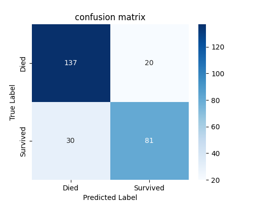
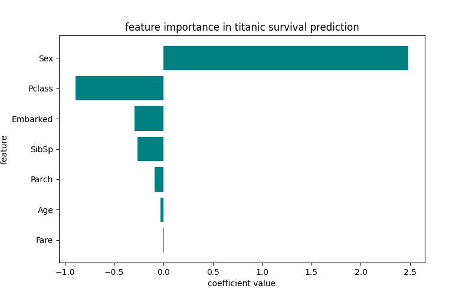

project title&overview
#titaiinc survival prediction
a machine learning model to predict wether a passenger survived the titanic disaster

##project overview
this project uses logistic regression to analyze passenger data and predict survival outcomes.

##folder structure

titanic_survival.py #main script

model_utils.py #save/load functions

predict.py #prediction function

titanic_model.pkl #trained model

dataset  #titanic.csv Titanic dataset

images : confusion_matrix.png #confusion_matrix visualization & feature_importance.png #feature importance visualization

README.md  #Documentation

##dataset information

- **Pclass** (1st, 2nd, or 3rd class)

- **Sex** (Male = 0, Female = 1)
- **Age**(Years)
- **SibSp** (siblings/spouses aboard)
-  **Parch** (parents/children aboard)
-  **Fare** (ticket fare price)
- **Embarked** (C = 0, Q = 1, S = 2)


##How to run project
### ** install dependencies**
```bash
pip install pandas numpy scikit-learn matplotlib seaborn joblib

```
### ** train & save model**
```bash
python titanic_survived.py
```
### ** load& test model**
```bash
from mudel_utils import load_model
from predict import predict_survival

model = load_model()

passenger_info = {"Pclass": 1, "Sex": 1, "Age": 28,
"SibSp": 0, "Parch": 0, "Fare": 50, "Embarked": 0}

prediction = predict_survival(model, passenger_info)
print("survival prediction:", prediction)
```
## visualizations
Confusion Matrix:


Feature Importance:


## Results
- **Model Accuracy:** **81%**
- **Precision, Recall, F1-score
reported in `classification_report`**

## Feature Improvements
- **test with other models like Random Forest or Neural Networks**
- **Perform feature engineering for better accuracy**

## Author
Developed by **[Ashkan gharibi]**